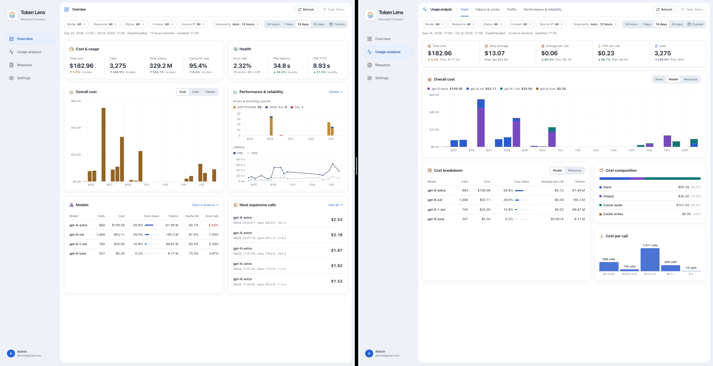
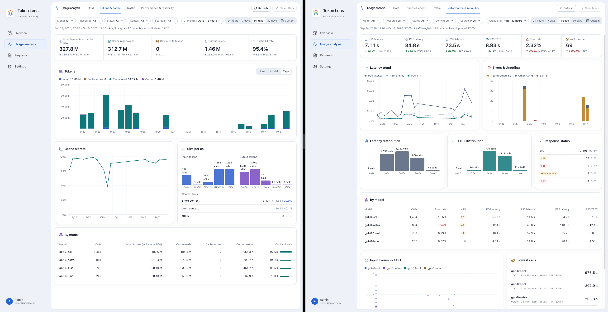
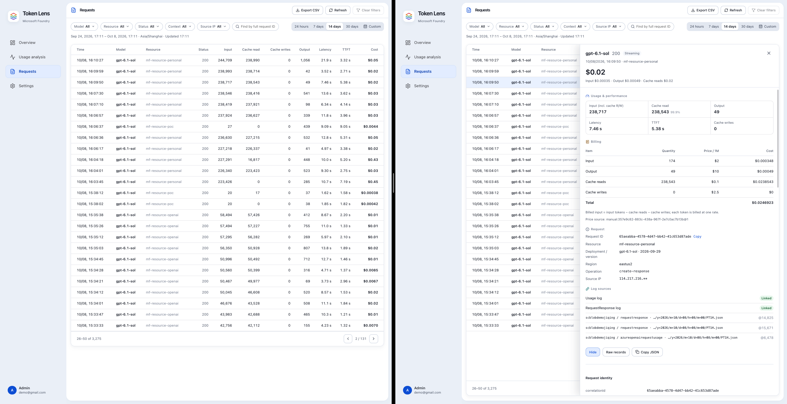
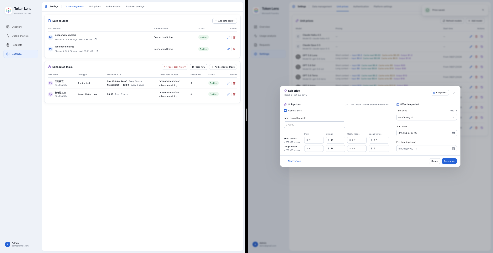

# FoundryTokenLens

A self-hosted dashboard for Microsoft Foundry usage. It reads the diagnostic logs your Foundry resources already write to Azure Blob Storage and turns them into request-level token, cost and performance reports.

## Features

- **Request-Level Data**: Each call's Usage and RequestResponse records merged into one request with tokens, cost, status, latency and caller IP
- **Incremental Import**: Scheduled scans with day/night intervals and a review window that read only new or changed log data
- **Manual Pricing**: Effective periods, short/long context tiers and text/image templates, with prefill from the Azure Retail Prices API
- **Long/Short Context**: Priced calls classed as short context, long context or Other; filter any view by it and see each class's calls, cost and cost share
- **Reports**: Overview, cost, tokens & cache, call distribution, performance & reliability, plus a request explorer with CSV export
- **Shared Filters**: Model, resource, status, context, source IP, time range, granularity and time zone, kept in the URL
- **System Logs**: Scan runs and settings changes, filterable by category and level, with configurable size, retention and recorded events
- **Data Management**: Storage broken down into monitoring data, platform data and system logs; clear imported data in one step while users, sources and prices stay and Blob files are untouched
- **Accounts**: Local administrators and read-only users, plus optional Microsoft Entra sign-in for allowed tenants
- **Bilingual UI**: Chinese and English

## Screenshots









## How It Works

- Reads the `insights-logs-azureopenairequestusage` and `insights-logs-requestresponse` containers via a connection string or managed identity
- Merges records by `resourceId` and `correlationId`; tokens come only from Usage logs and are never estimated when missing
- Prices each request at the price in effect when it ran, billing uncached input, cache reads and cache writes separately, and recalculates when logs or prices change
- Bills long context when prompt tokens exceed the price's threshold, otherwise short; single-row prices count as Other. The class is saved with the cost, so filters always match billing
- Stores everything in one SQLite database, and one Node.js process serves both the UI and the API

## Security

- The first administrator is created in the browser on the first visit, and that address becomes the platform URL. Until then anyone who can reach the site can claim it, so finish setup right after deploying.
- Only requests from the platform URL can sign in or change data, and every change must carry the app's request header.
- Data source credentials and the Entra client secret are encrypted with AES-256-GCM and never returned by the API.
- The initial administrator cannot be deleted or demoted, and at least one enabled local administrator always remains.
- `/api/health` is unauthenticated for health probes.

## Quick Start

### Docker

```bash
docker run -d --name foundrytokenlens --init --restart unless-stopped \
  -p 127.0.0.1:8080:8080 \
  -v ftl-data:/app/data \
  ghcr.io/heyjiqingcode/foundrytokenlens:0.0.1
```

Open the platform URL, create the administrator, then add a data source, prices and a scheduled task under **Settings**.

> The image runs as UID 1000 and keeps its database and key in `/app/data`.\
> See [Configuration](#configuration) for every available variable.

### Local

Requires [Node.js 24](https://nodejs.org/) and Git. Clone the repository, install dependencies, build, then start:

```bash
git clone https://github.com/HeyJiqingCode/FoundryTokenLens.git
cd FoundryTokenLens
npm ci
npm run build
npm start
```

Open `http://localhost:8080` and finish the same first-run steps as Docker. The database and key are created in `data/` under the repository.

To update, pull and rebuild, then start again:

```bash
git pull
npm ci
npm run build
npm start
```

> `npm ci` compiles the SQLite driver for your Node.js version. Run it again after switching Node.js major versions; where no prebuilt binary exists it needs Python 3 and a C++ toolchain.\
> The server listens on `127.0.0.1:8080`; set `FTL_HOST` / `FTL_PORT` to change it.

## Configuration

| Variable           | Description                                                                                                                                                                      | Default                              |
| ------------------ | -------------------------------------------------------------------------------------------------------------------------------------------------------------------------------- | ------------------------------------ |
| `FTL_PUBLIC_URL`   | Platform URL. Overrides the address recorded at setup or saved in Entra settings; only requests from it can sign in or change data, and the Entra redirect URI is built from it. | _address recorded at setup_          |
| `FTL_SECRET_KEY`   | Base64-encoded 32-byte master key that encrypts credentials and signs sessions. If it is lost or changed, saved credentials can no longer be decrypted and all sessions end.     | _generated as `data/.secret-key`_    |
| `FTL_HOST`         | Listen address                                                                                                                                                                   | `127.0.0.1` (`0.0.0.0` in the image) |
| `FTL_PORT`         | Listen port                                                                                                                                                                      | `8080`                               |
| `FTL_WEB_DIR`      | Directory of the built UI                                                                                                                                                        | `dist/web`                           |
| `FTL_DEV_API_PORT` | API port behind the development server (`npm run dev` only)                                                                                                                      | `8081`                               |

> To move to a new domain, set `FTL_PUBLIC_URL` and restart.\
> The data directory is always `data/` under the working directory (`/app/data` in the image).

## Local Development

### Project Structure

```text
src/
  server/       HTTP API, log import, pricing, accounts and persistence
  shared/       Types, rules and translations used by both sides
  web/          React UI: components/, features/ by page, styles/
tests/          Unit and API tests; browser/ holds the Playwright tests
scripts/        Development scripts
```

### Dev Server

Start the API and the UI with hot reload:

```bash
npm ci
npm run dev
```

- The UI runs on `http://localhost:8080` and proxies `/api` to the API on `127.0.0.1:8081` (`FTL_DEV_API_PORT`), which restarts on server changes.
- It uses the same `data/` directory as `npm start`. There are no schema migrations: after a schema change, empty `data/` and set up again.

### Checks

Run the full check before committing — formatting, lint, type check, unit and API tests, production build and browser tests:

```bash
npx playwright install chromium
npm run check
```

> Browser tests start their own UI on port 8099 against a mocked API and never touch `data/`.\
> CI runs the same check on every push to `main` and every pull request; a `v*` tag also publishes the image and a GitHub release.

## More Details

For accounts and sign-in, data sources and scheduled tasks, pricing, and how each report is calculated, see the user manuals:

- [中文使用手册](./docs/user-manual.zh-CN.md)
- [User Manual (English)](./docs/user-manual.en-US.md)
